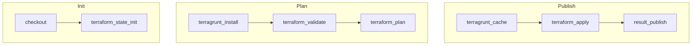
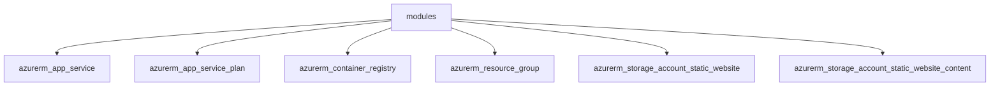
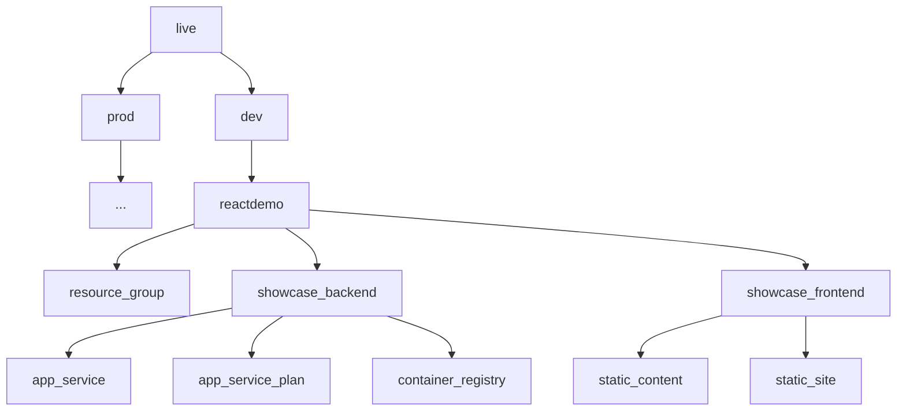
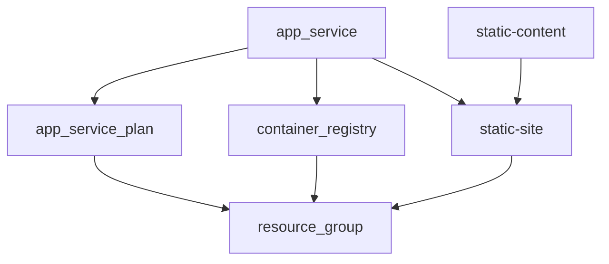

# DevOps Installation

### 1. Create Service Connection "azuresp"

### 2. Set up Test Cases in Testsigma by importing the file test/testsigma/back_up_2023-03-11_04_29_31.441.zip
Record API Key, test environment id, and test plan id.

### 3. Create Variable Group named "terraform-dev" with the following variables

| Name | Value |
| ----------- | ----------- |
| DEMO_RESOURCE_GROUP | rg-showcase-dev-001b |
| DEMO_STORAGE_ACCOUNT | stshowcasedev001b |
| REMOTE_STATE_LOCATION | eastus |
| REMOTE_STATE_RESOURCE_GROUP | msc-terraform-rg |
| REMOTE_STATE_STORAGE_ACCOUNT | mscterraformstg |
| REMOTE_STATE_STORAGE_CONTAINER | msc-terraform-state |
| SPN | azuresp |
| TERRAGRUNT_VERSION | 0.35.10 |
| TESTSIGMA_API_KEY | [Replace with real value] |
| TESTSIGMA_TEST_ENVIRONMENT_ID | [Replace with real value] |
| TESTSIGMA_TEST_PLAN_ID | [Replace with real value] |

Adjust the variable values if necessary to avoid conflict.

### 4. Upload the entire folder 'iaam\splunk' to a web server (e.g. Azure Storage Account Static Site)
       
### 5. Adjust the settings inside the file 'live\dev\iaam\splunk\splunk.hcl'
| Name | Value |
| ----------- | ----------- |
| splunk_config_url | This is the URL of the uploaded splunk config folder 'iaam\splunk\config' |
| splunk_scripts_url | This is the URL of the uploaded splunk scripts folder 'iaam\splunk\scripts' |
| splunk_download_url | This is the URL of the uploaded splunk installer file 'iaam\splunk\splunk-8.1.0-f57c09e87251-Linux-x86_64.tgz' |
| splunk_resource_group_name | This is the name of the resource group containing all the splunk resources |
| splunk_network_prefix | This is the splunk vnet prefix |
| splunk_dns_zone | This is the splunk services domain name |
| splunk_appg_domain | This is the splunk application gateway host name |
| splunk_bastion_domain | This is the host name mapped to the splunk network bastion public ip |
| splunk_dsoutbound_domain | This is the host name mapped to the splunk deployment server outbound load balancer public ip |

### 6. Create a pipeline using file "azure-pipelines.yaml"

### 7. Run the pipeline and verify the followings
- Resources inside the resource group "msc-terraform-rg"
  - mscterraformstg (storage account with terraform state container)
- Resources inside the resource group "rg-showcase-dev-001b"
  - asp-showcase-dev-001b (app service plan)
  - azapp-showcase-dev-001b (app service)
  - regshowcasedev001b (container registry)
  - stshowcasedev001b (storage account with static site enabled)
- Resources inside the resource group "splunk"
  - See the file 'iaam\splunk\Azureresources.csv' for a complete list of sample splunk resources
- React Demo Application
  - Access the Static website URL from storage account "stshowcasedev001b" and confirm the React Demo application page is shown.
  - Access the URL from app service "azapp-showcase-dev-001b" and confirm the nginx page is shown
- Splunk Application
  - Click the Backend Health inside the application gateway 'splunk-splunk-appg' and confirm all the splunk services are in healthy state
  - Record the domain name of the application gateway 'splunk-splunk-appg'
  - Access http://[application_gateway_domain_name]:8001 to open the splunk cluster master console
  - Login as user 'splunkadmin' with password 'Password123Password123'
  - Verify that there is no error next to "Administrator" link at the top
  - Click Settings >> Monitoring Console >> Health Check >> Start
  - Verify there is no error listed inside the health check page
  - [Optional] Use Bastion to login to any splunk VM with following settings
    -- User: splunkadmin
    -- Authentication Type: SSH Private Key from Local File
    -- Local File: Choose iaam\splunk\vm_ssh_login_key_file

# Pipeline Stages

# Terragrunt Key Features

### 1. Keep your backend configuration DRY
Terragrunt allows you to keep your backend configuration DRY (“Don’t Repeat Yourself”) by defining it once in a root location and inheriting that configuration in all child modules.  
[Example](/live/terragrunt.hcl)

### 2. Keep your provider configuration DRY
Terragrunt allows you to refactor common Terraform code to keep your Terraform modules DRY. Just like with the backend configuration, you can define the provider configurations once in a root location.  
[Example](/live/terragrunt.hcl)

### 3. Promote immutable, versioned Terraform modules across environments
Terragrunt allows you to define your Terraform code once and to promote a versioned, immutable “artifact” of that exact same code from environment to environment.  
[Example](/live/dev/reactdemo/showcase_backend/app_service/terragrunt.hcl)

# Terragrunt in Action

### Terraform Modules for React Demo

### Terragrunt Files for React Demo

### Resource Dependencies for React Demo

